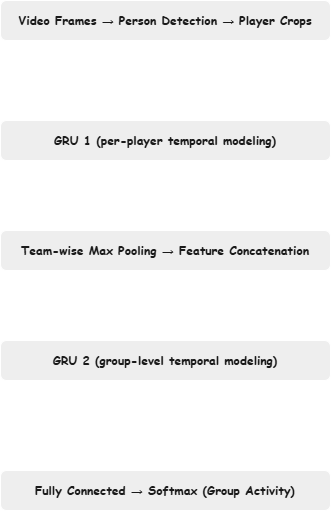

<h1 align="center">Group Activity Recognition</h1>

<p align="center">
  An implementation of the <strong>CVPR 2016 paper</strong>, <a href="https://arxiv.org/abs/1511.06040"><em>A Hierarchical Deep Temporal Model for Group Activity Recognition</em></a>.  
  This project focuses on recognizing group activities in volleyball matches using deep learning, temporal modeling, and player-level feature aggregation.
</p>

---

## Table of Contents
1. [Key Updates](#key-updates)
2. [Usage](#usage)
   - [Clone the Repository](#1-clone-the-repository)
   - [Install Dependencies](#2-install-the-required-dependencies)
   - [Download Model Checkpoint](#3-download-the-model-checkpoint)
3. [Dataset Overview](#dataset-overview)
4. [Baselines](#baselines)
5. [Performance Comparison](#performance-comparison)
6. [Interesting Observations](#interesting-observations)
7. [Model Architectures](#model-architectures)

---

## Key Updates

- Reimplemented **Baselines 1, 3, 4, 5** from the original paper in PyTorch.
- Merged the concepts of **B7 and B8** into a single **END baseline** for improved temporal modeling and spatial pooling.
- Switched to **ResNet-50** for feature extraction.
- Achieved competitive performance compared to the original paper, with clear improvements in temporal baselines.

---

## Usage

### 1. Clone the Repository
```bash
git clone https://github.com/yourusername/group-activity-recognition.git
```

### 2. Install the Required Dependencies
```bash
pip3 install -r requirements.txt
```

### 3. Download the Model Checkpoint
Use the Kaggle Hub API:
```python
import kagglehub
path = kagglehub.model_download("omaryasserace/endmodelv2/pyTorch/default")
print("Path to model files:", path)
```

---

## Dataset Overview

The dataset is the **Volleyball Dataset** introduced in the CVPR 2016 paper.

- **Videos**: 55, each assigned a unique ID (0–54).
- **Frames**: 4,831 annotated frames from 55 volleyball videos.
- **Group Activities**: 8 classes (e.g., left spike, right pass, winpoint).
- **Player Actions**: 9 classes (e.g., waiting, setting, spiking).
- **Number of Instances**:
  | Group Action Class    | Number of Instances |
  |-----------------      |---------------------|
  | Right set             | 644                 |
  | Right spike           | 623                 |
  | Right pass            | 801                 |
  | Right winpoint        | 295                 |
  | Left winpoint         | 367                 |
  | Left pass             | 826                 |
  | Left spike            | 642                 |
  | Left set              | 633                 |


  | Player Action Class   | Number of Instances |
  |-----------------      |---------------------|
  | Waiting               | 3601                |
  | Setting               | 1332                |
  | Digging               | 2333                |
  | Falling               | 1241                |
  | Spiking               | 1216                |
  | Blocking              | 2458                |
  | Jumping               | 341                 |
  | Moving                | 5121                |
  | Standing              | 38696               |


- **Train Videos**: 1, 3, 6, 7, 10, 13, 15, 16, 18, 22, 23, 31, 32, 36, 38, 39, 40, 41, 42, 48, 50, 52, 53, 54.
- **Validation Videos**: 0, 2, 8, 12, 17, 19, 24, 26, 27, 28, 30, 33, 46, 49, 51.
- **Test Videos**: 4, 5, 9, 11, 14, 20, 21, 25, 29, 34, 35, 37, 43, 44, 45, 47.

- For download the dataset: [link](https://github.com/mostafa-saad/deep-activity-rec).
- further information about the dataset, see the paper for more details: [link](https://arxiv.org/abs/1511.06040).

---

## Baselines

### **B1: Image Classification**
Single-frame group activity classification using ResNet-50 fine-tuned for the 8 group activity labels.

### **B3: Fine-tuned Person Classification**
Each detected player is cropped, features are extracted using ResNet-50, pooled over all players in the frame, and fed to a classifier.

### **B4: Temporal Model with Image Features**
Uses ResNet-50 features from each frame of a 9-frame clip, followed by an LSTM for temporal modeling.

### **B5: Temporal Model with Person Features**
Temporal extension of B3 — person crops are processed over 9 frames, pooled across players, and fed to an LSTM.

### **END: Merged Team-Dependent Two-Stage Model**
Combines concepts from B7 and B8:
- **Stage 1**: GRU processes sequences of person-level features (ResNet-50 backbone).
- **Stage 2**: Players are split into two teams, max-pooled within each team, concatenated, and passed to a second GRU for group-level classification.
- Improves positional awareness and temporal consistency by retaining team structure.

---

## Performance Comparison

- **Original Paper Accuracy**
- 

- **My Accuracy**

  | Baseline      | My Accuracy | My F1 Score |
  |---------------|-------------|-------------|
  | B1            | 75%         | 76%         |
  | B3            | 80%         | 81%         |
  | B4            | 74%         | 76%         |
  | B5            | 87%         | 87%         |
  | END (B7+B8)   | 89%         | 89%         |


---

## Interesting Observations

- **Pooling without team separation** (B5) often confused left/right activities (e.g., l_winpoint vs r_winpoint).
  
- **Team-dependent pooling** in END baseline significantly reduced directional confusion by keeping positional context.
  
- Temporal models (B4, B5, END) outperformed frame-based models (B1, B3) in nearly all cases.

---

## Model Architectures

### **END Baseline Architecture**



- **Stage 1** captures player-level temporal dynamics.
- **Stage 2** models team interactions over time.
- **Positional awareness** preserved by pooling within teams before concatenation.

---

**Training Configuration**
- Optimizer: AdamW
- Batch Size: 4
- Learning Rate: 0.00006
- Epochs: 90
- Hardware: Kaggle GPU (T4)

---
